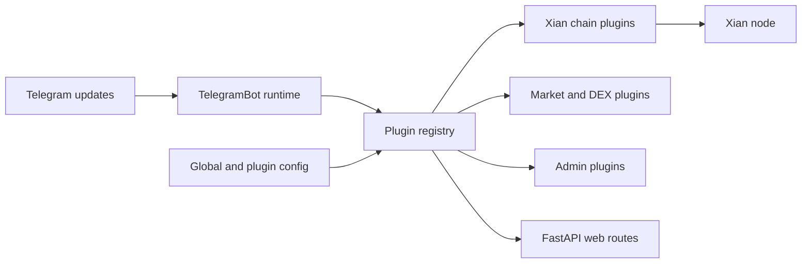

# xian-tg-bot

`xian-tg-bot` is a plugin-first Telegram bot framework for Xian. It wraps
[`python-telegram-bot`](https://github.com/python-telegram-bot/python-telegram-bot)
with async-first plugin discovery, an embedded FastAPI HTTP layer, SQLite
persistence helpers, and a manifest-driven configuration system, then
ships a sizable set of Xian-specific plugins (balances, transfers, prices,
DEX trades, charts, lotteries, admin, …) as ready-to-run features.

## Runtime Shape



## Quick Start

```bash
git clone https://github.com/xian-network/tg-bot.git
cd tg-bot
poetry install
```

Create a `.env`:

```env
TG_TOKEN=your_bot_token
LOG_LEVEL=INFO        # DEBUG, INFO, WARNING, ERROR
LOG_INTO_FILE=true
```

Run the bot:

```bash
poetry run python main.py
```

For a PM2-managed production profile:

```bash
chmod +x start.sh
pm2 start pm2.config.json
pm2 logs tg-bot
pm2 restart tg-bot
pm2 save && pm2 startup     # persist across reboots
```

## Principles

- **Plugins are units of feature.** Every command, handler, web route, and
  scheduled job lives inside an isolated plugin under `plg/`. The
  framework wires them up.
- **Async-first.** Handlers, jobs, and storage are async (`asyncio` +
  `aiosqlite`). The framework expects coroutine-based plugin code.
- **Pluggable HTTP layer.** Plugins can expose FastAPI routes through
  `WebAppWrapper`, so the same process serves Telegram and HTTP traffic.
- **Manifest-driven config.** Global defaults live in `cfg/global.json`;
  per-plugin overrides live in `cfg/<plugin>.json`. Secrets stay in
  environment variables.
- **Operational tooling baked in.** Structured logging via `loguru`,
  graceful shutdown, and PM2-ready scripts.

## Key Directories

- `main.py` — `TelegramBot` runtime and lifecycle.
- `plugin.py` — `TGBFPlugin` base class, manifest utilities, decorators.
- `web.py` — FastAPI wrapper that plugins extend.
- `plg/` — feature plugins. Each plugin lives under `plg/<feature>/` and
  contains handlers, optional web endpoints, and per-plugin resources.
  Bundled plugins include:
  - **Wallet / chain** — `balance`, `address`, `send`, `tip`, `rain`,
    `simulate`, `submit`, `approve`, `event`, `tokens`, `tokenomics`.
  - **Markets / DEX** — `price`, `chart`, `trend`, `buy`, `sell`,
    `cex`, `buybot`.
  - **Network / data** — `active`, `api`, `testnet`, `backup`, `update`.
  - **Operator / admin** — `admin`, `manage`, `shutdown`, `logfile`,
    `debug`, `error`, `feedback`.
  - **Community / fun** — `lottery`, `bless`, `start`, `help`, `about`,
    `all`.
- `cfg/` — global defaults (`global.json`) and plugin configs.
- `res/` — shared static assets.
- `tests/` — async `pytest` suite (with `pytest-asyncio`).
- `pm2.config.json`, `start.sh` — production process management.

## Configuration

Global settings (`cfg/global.json`):

```json
{
  "admin_tg_id": 123456789,
  "webserver_port": 5000,
  "xian": {
    "node": "http://127.0.0.1:26657",
    "explorer": "https://explorer.xian.org",
    "chain_id": "your-chain-id"
  }
}
```

Each plugin may provide `cfg/<plugin>.json` with keys such as `handle`,
`requires`, `description`, `category`, `aliases`, `blacklist`, and
`whitelist`.

## Plugin Development

- Place handlers in `plg/<feature>/<feature>.py` with a class that inherits
  `TGBFPlugin`.
- Define an optional `MANIFEST` attribute or rely on
  `PluginManifest.materialize` for default registration.
- Register jobs, handlers, and web routes through the helper methods on
  `TGBFPlugin`.
- Add tests under `tests/` mirroring the plugin module; stub external
  services where needed.

See `plg/README.md` for detailed patterns and `AGENTS.md` for contributor
expectations.

## Validation

```bash
poetry run pytest                # async test suite
poetry run ruff check .          # lint
poetry run mypy .                # type check
poetry run python main.py        # launch with current config
```

## Updating

```bash
pm2 stop tg-bot
git pull origin main
poetry install
pm2 restart tg-bot
```

Review release notes for configuration or schema changes, and run the test
suite before restarting.

## Requirements

- Python 3.14
- Poetry ≥ 1.6 (`curl -sSL https://install.python-poetry.org | python3 -`)
- Telegram bot token in `.env`
- Optional: PM2 for production process management
  (`npm install -g pm2`)

## Related Docs

- [plg/README.md](plg/README.md) — plugin development patterns
- `AGENTS.md` — contributor expectations
- [`python-telegram-bot`](https://github.com/python-telegram-bot/python-telegram-bot) — underlying Telegram client
